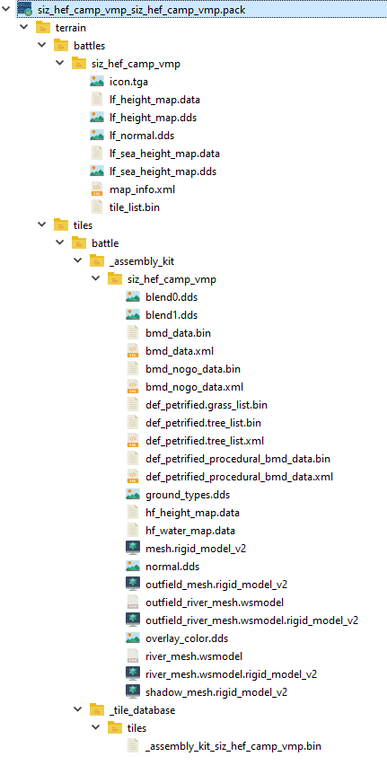

# Extended map .pack file

TL;DR : create a `battles_tables` DB entry for your map, in order to access hidden map features

## Requirements
You're going to need a pack file editor, like [RPFM](https://github.com/Frodo45127/rpfm)

## Introduction
When you export a map from Terry, it creates .pack file that contains everything needed to create a custom land battle in the game.


Now let's open the pack file.<br>
(The file is found in `.../Total War WARHAMMER 2/data`, and you can open it with RPFM.)
The expected contents are:



Let's go through the contents briefly:
* Everything is inside the `terrain` folder :
    * the `terrain/battles/YOUR_MAP` folder contains 
        * the vista data
        * `icon.tga` is the preview image for the map in-game
        * `map_info.xml` contains the meta-data for your map
    * the `tiles/battle` contains your map's data, in the format that the game needs


The actual file that leads to the creation of the custom battle is `map_info.xml`. Unfortunately there isn't much you can do with that file:
```xml
<map_info>
    <display_name>High Elf Camp Vampire</display_name>
    <description></description>
    <author>Sizertz</author>
    <team_size_1>4</team_size_1>
    <team_size_2>4</team_size_2>
    <environment>weather/battle/wh_volcano_02.environment</environment>
</map_info>
```
The `environment` tag doesn't even work.

However, this is not the system that CA uses for their own battles, but a cut-down version made specifically for user-created maps.<br>
CA's battles are instead defined in the `battles_tables` DB table. This table has a lot more features than `map_info.xml`, among which:
* battle types : land, siege, ambush, FFA, ...
* environments (that work!)
* fund multipliers
* ambiant sounds

This is the whole point of this tutorial: instead of using `map_info.xml` to create our battle, we're going to create our own `battles_tables` entry.


#### Step 1 - Get the files
Download [the template pack file](./_free_stuff/files/extended_map_pack_file.pack)

You can also create them manually or get the ones from another mod. But this template has some default values that are meant to help

You should have three filse :
- a DB file in `db/battles_tables` (this is where the main magic happens)
- a .loc file in `text/db` (this is where you put UI text and translations)
- an image (.tga or .png) file in `ui/frontend ui/batte_map_images`


#### Step 2 - rename the files
Open the .pack in RPFM and rename all the files.

It is essential for mod compatibility that no two files in your game's data have the same path.<br>
Therefore, you should always name your files with a name that is unique.<br>
My recommendation is to use your username and your mod's title, as this is almost certainly going to be unique : <code>YOU_MOD_TITLE</code><br>
e.g. I prefix all my files with "siz_"

#### Step 3 - edit battles_tables
Let's take the columns one by one:

* `Key` : this should be a unique ID for your map.
    - just like file names, you will get compatibility issues if this isn't unique
    - my recommendation : something of the form `YOU_MAP_TITLE`
* `Type` : Values from `battle_types_tables`. Use RPFM dropdown. (Needs testing but) from what I can tell, values that work in WH are: 
    - `classic` : the standard Land battle
    - `siege` (you'll need more work than that for it to work, see [Frodo's siege tutorial](https://tw-modding.com/docs/battle-map-editing/siege-battle-maps-wh/))
    - `ambush`
    - `river_crossing_battle`
    - `unfortified_settlement`
    - `underground_intercept`
    - `free_for_all`
    - rest come from other games
* `Is Naval` : unused in WH
* `Specification` : the `terrain/battles/???` folder that contains your map.   
    - You can find the exact value by opening your map's .pack file
* `Screenshot Path` : The preview image that is used in the map selection menu for custom battles.
    - this replaces `terrain/battles/YOUR_MAP/icon.tga`, which will no longer be used
* `Map path` : unused in WH
* `Team size 1` : max players in team 1 (up to 4)
* `Team size 2` : max players in team 2 (up to 4)
* `Release` : leave checked (needs testing)
* `Multiplayer` / `Singleplayer` : make map available in
* `Intro Movie` : ???
* `Year` : unused in WH
* `Defender Funds Ratio` : funds for defender are multiplied by this.
    - WARNING : when creating a new table row in RPFM, the default value for this is 0 which will make the map unplayable.
* `Has Key Buildings` : unused in WH
* `Matchmaking` : should probably leave unchecked
* `Playable Area Width/Height` : unused in WH, leave at 0
* `is Large Settlement` : unused in WH
* `Has 15m Walls` : check for siege maps
* `Is underground` : I'll let you guess that one
* `Catchment Name` : ? campaign stuff
* `Tile upgrade` : ? campaign variant stuff
* `Battle environment` : the environment used for your map.
    - if left empty, a random environment gets chosen
    - environment = skybox + lighting + weather
    - list of values [can be found here](./wh2-environments.html)
    - for a convenient way to test environments in-game, check out the [environment testing pack in the Free Stuff! section](./free_stuff.html)
* `Battle environment audio` : ambiant sounds from
    - values from `audio_battle_environments`. Use RPFM dropdown

If you want to make a map pack, you can create several rows in the table, one for each battle.

#### Step 4 - edit the .loc
This file just contains the title for your map.
* `Key` MUST be equal to `battles_localised_name_BATTLE_KEY` where `BATTLE_KEY` is the `Key` value for your map in the `battles_tables` DB
* `Text` will be the title for your battle, the one you find in the map selection list

This overrides whatever you wrote in Terry's UI

#### Step 5 - choose a screenshot
Take a screenshot and place it at the path you specified in `Screenshot Path` in the DB<br>
.tga and .png files are accepted

#### Step 6 - Testing the extended pack file
Now all you need to do is :
1. place your newly edited .pack file in your game's `data` folder
2. activate it in your mod manager
3. launch the game
4. profit!

Notes
* your new battle will appear in the custom battle selection menu, under the type you chose and with the CA icon instead of the wrench icon
* in the 'Land Battles', you will still find an entry for your map with the wrench icon. This entry is generated by `terrain/battles/YOUR_MAP/map_info.xml` and does not take `battes_tables` into account. You can delete `map_info.xml` to get rid of it, but Terry will keep re-creating it on every export, so you should probably ignore it until:

#### Step 7 - Publishing
When you eventually publish your map, you want to merge the extended pack file and the Terry-exported file, so as to publish a single mod to the workshop.

You also probably want to delete `terrain/battles/YOUR_MAP/map_info.xml`, to get rid of the land battle (with the wrench icon) that doesn't take battles_tables into account

You do not want to add the extended stuff directly to your Terry exported file while you are still working the map, because Terry will overwrite the file every time you export, which would force you to repeat the process.
